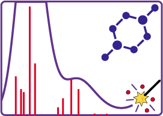

<h1>UV-Vis Sp3ctrum P4tronum</h1>
<figure>
  	
</figure>

This code aids molecular dynamics simulations to study the overall contribution to the UV-vis spectrum from the selected frames. It enables both overlaid and separated spectra.

<h2>Instructions:</h2>
Download the latest version released on <a href="https://github.com/lopesth/UV-Vis-Sp3ctrum-P4tronus/archive/2.0.1.zip"> here </a> and unzip the folder in the Home folder.
 
<h3>Linux or macOS:</h3>
If you do not have Python 3 installed, install, preferably by <code>apt-get install python3.6</code> (Ubuntu or another Debian-based), <code>yum install python3.6</code> (Fedora or Fedora-based) or <a href="https://brew.sh/index_pt-br.html">Homebrew<a> or <a href="https://www.macports.org">Macports<a> (macOS).
<h4>Modes:</h4>
- Terminal with answer and friendly questions: 
<code>sp3trum_app -friendly</code> 
- Terminal with file with the parameters fed in execution: 
<code>sp3trum_app -file file.in</code> 
- Graphical User Interface: 
<code>sp3trum_app -gui</code> 
<h3>Windows:</h3>
For Windows, you will need to install <a href="https://www.python.org/ftp/python/3.6.3/python-3.6.3-amd64.exe"> Python3.6.

<h2>Powered by:</h2>
<h4>Programmer</h4>
Thiago Oliveira Lopes 
<a href="http://lattes.cnpq.br/8870631835172791"> Currículo Lattes</a> / <a href="https://twitter.com/thiago_o_lopes"> Twitter </a> / <a href="https://www.linkedin.com/in/thiago-lopes-1972b270"> Linkedin </a> / <a href="https://www.researchgate.net/profile/Thiago_Lopes2"> Research Gate</a>
<h4>Writer</h4>
Daniel Francsico Scalabrini Machado 
<a href="http://lattes.cnpq.br/9791047274773689"> Currículo Lattes</a> / <a href="https://www.researchgate.net/profile/Daniel_Francisco_Machado">Research Gate</a>
<h4>Advisor</h4>
Professor Dr. Heibbe C. B. de Oliveira 
<a href="http://lattes.cnpq.br/5995553993631378"> Currículo Lattes</a>  / <a href="https://www.researchgate.net/profile/Heibbe_De_Oliveira2">Research Gate</a>
<h3>Research Group</h3>
<figure>
  	
</figure>
Laboratório de Estrutura Eletrônica e Dinâmica Molecular (LEEDMOL).
<a href="https://www.facebook.com/leedmol/" > Facebook </a>
